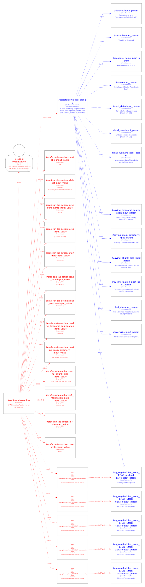

# Provenance tracking

The Ingestion Pipeline provides [helpers](../ingestion_pipeline/provenance) and [script](./generate_crate.py) to infer the provenance of each execution through the RO-Create standard.

## Getting started

### Prerequisites

1. A provenance log (`ingestion_pipeline.utilities.provenance.ProvLogger`) shall be available as an input for the provenance script. Thus, first follow the [installation](../README.md#installation-and-setup) and [usage](../README.md#usage) steps to run the ingestion pipeline.
1. The provenance script requires some dependencies that are included in [\`environment_prov.yml](../environment_prov.yml). Assuming the environment created in the previous step, install the required packages with:

```bash
$ mamba install -f environment_prov.yml
```

### Usage

```bash
$ ./scripts/generate_crate.py --help
usage: generate_crate.py [-h] --logfile-prov-path LOGFILE_PROV_PATH --main-class-path MAIN_CLASS_PATH --docstring-convention DOCSTRING_CONVENTION [--request-id REQUEST_ID]
                         [--output-crate-path OUTPUT_CRATE_PATH] [--debug]

Generate a RO-Crate for an ingestion pipeline run.

options:
  -h, --help            show this help message and exit
  --logfile-prov-path LOGFILE_PROV_PATH
                        Path to the provenance log in JSON format generated by the ingestion pipeline.
  --main-class-path MAIN_CLASS_PATH
                        Path to the main class of the ingestion pipeline to extract docstrings from.
  --docstring-convention DOCSTRING_CONVENTION
                        Docstring convention used in the main class. Default is 'numpy'.
  --request-id REQUEST_ID
                        Request ID to filter the provenance logs. If not provided, the last request ID in the log file will be used.
  --output-crate-path OUTPUT_CRATE_PATH
                        Path to save the generated RO-Crate. Default is 'ingestion_pipeline_run_crate'.
  --debug               Enable debug logging output.
```

Hence, assuming the availability of the provenance log in `./ingestion_provenance.log` (obtained through a previous execution of the ingestion pipeline), triggering the provenance script would  look like:

```bash
$ ./scripts/generate_crate.py --logfile-prov-path ./ingestion_provenance.log --main-class-path "ingestion_pipeline.ingestion.ERA5IngestionPipeline" --docstring-convention numpy
```

Note the need of additionally passing the path to the main class and convention so that the script is able to programmatically gather metadata information from the docstrings.

#### The provenance log

An example of the provenance log would be:

```json
{"message": "Starting ERA5 ingestion pipeline script.", "action": "/start", "python_version": "3.11.14", "workflow_file": "./scripts/download_data_era5.py", "timestamp": "2026-01-27T12:30:08.238696+00:00", "request_id": "f1a2b25b-233f-4171-8d79-7a462af0a392"}
{"message": "Running ERA5IngestionPipeline for variable: tas", "action": "/create", "action_id": "era5-ingestion-pipeline-run-tas-action", "timestamp": "2026-01-27T12:30:08.238828+00:00", "request_id": "f1a2b25b-233f-4171-8d79-7a462af0a392"}
{"message": "Input arguments for ERA5IngestionPipeline", "action": "/input", "input_args": {"dataset": "derived-era5-single-levels-daily-statistics", "variable": "tas", "pressure_level": null, "area": [75, -30, 30, 50], "start_date": "1940-01-01", "end_date": "2024-12-31", "max_workers": 4, "saving_temporal_aggregation": "monthly", "saving_main_directory": "/tmp/data/oscars-rsotc", "saving_chunk_size": {"time": 500, "lat": 50, "lon": 50}, "s3_dir": "", "overwrite": false}, "timestamp": "2026-01-27T12:30:08.566791+00:00", "request_id": "f1a2b25b-233f-4171-8d79-7a462af0a392"}
{"message": "Aggregated 5 gridded and regions files.", "action": "/output", "output_files": ["/tmp/data/oscars-rsotc/aggregate/tas_None_ERA5_gridded.zarr", "/tmp/data/oscars-rsotc/aggregate/tas_None_ERA5_NUTS-0.zarr", "/tmp/data/oscars-rsotc/aggregate/tas_None_ERA5_NUTS-1.zarr", "/tmp/data/oscars-rsotc/aggregate/tas_None_ERA5_NUTS-2.zarr", "/tmp/data/oscars-rsotc/aggregate/tas_None_ERA5_NUTS-3.zarr"], "output_group": "aggregated", "timestamp": "2026-01-27T12:30:12.203385+00:00", "request_id": "f1a2b25b-233f-4171-8d79-7a462af0a392"}
{"message": "Finished run of ERA5IngestionPipeline for variable: tas", "action": "/create_end", "action_id": "era5-ingestion-pipeline-run-tas-action", "timestamp": "2026-01-27T12:30:12.215615+00:00", "request_id": "f1a2b25b-233f-4171-8d79-7a462af0a392"}
{"message": "Stopping ERA5 ingestion pipeline script.", "action": "/stop", "timestamp": "2026-01-27T12:30:12.215752+00:00", "request_id": "f1a2b25b-233f-4171-8d79-7a462af0a392"}
```

where each entry is charaterized by the type of action (e.g. `/start`) and associated data.

### Outputs

The resulting RO-Crate follows the [Workflow RO-Crate specification](https://www.researchobject.org/workflow-run-crate/profiles/workflow_run_crate/) and is stored by default under [`ingestion_pipeline_run_crate` folder](../ingestion_pipeline_run_crate/), or in the path provided through `--output-crate-path`.

#### Prospective and Retrospecive Provenance

The diagram below outlines the relationships between the provenance-related entities for the execution of a single action (`tas`) within the overall workflow. Note that the RO-Crate addresses both the prospective provenance (the workflow definition, **in blue**) and the retrospective provenance (the workflow execution, **in red**), where the action (`CreateAction`) plays a central role.



<!---->

#### The metadata file (`ro-crate-metadata.json`)

Hereinafter we will summarize some of the key entities present in the `ro-crate-metadata.json` file.

1. The *workflow itself* (`scripts/download_data_era5.py`), which:
   - links through `mainEntity` to the `scripts/download_data_era5.py` script
   - conforms to (through `conformsTo`) with base RO-Crate profiles, in particular workflow-run-crate-1.0 profile
     - *Issue?* The `generate-crate.py` script does not add conformance with process-run-crate
   - mentions (through `mentions`) the list of actions (`CreateAction` entity type)
1. The *workflow script file*
   - **Input parameters (`input`)** are formally described with `FormalParameter` type
     - Inputs correspond to the `ERA5IngestionPipeline` class constructor arguments
     - Labeled (by default) as `#<input_variable>-input_param`
     - Values for the input parameters are part of the description of the action (see below) making use of the `PropertyValue` type
   - **Outputs (`output`)**:
     - As it happens with inputs, output parameters are defined as the entity type `FormalParameter`.
     - The output parameters shall include:
       - S3 Cloud Storage (Zarr format):
         - Gridded dataset: {bucket}/{s3_dir}{variable}\_{pressure_level}\_ERA5_gridded.zarr
         - Regional datasets: {bucket}/{s3_dir}{variable}\_{pressure_level}_ERA5_{region_set}.zarr (one per region set)
       - Logs:
         - Standard logs: Recorded via logger (console/file)
         - Provenance logs: Recorded via logger_prov in JSON format for traceability
   - Additional metadata: `programmingLanguage`, ..
1. The **action (`action`)** describes the recorded steps in a workflow
   - The **inputs (`object`)**, such as values (`PropertyValue` type) and files (`File` type)
     - Identifier: `#<action_id>::<input_variable>-input_value`
     - The relationship between an actual value and the corresponding parameter is expressed through the `exampleOfWork` property, which links to the identifier of the `FormalParameter` definition (see above)
   - The **outputs (`result`)** collect the identifiers of the definitions for each output
     - Identifier: `#<output_type>::<file_name>-output_value`
     - Linking to the output formal parameter through `exampleOfWork` just like the input values
   - The executor (`agent`) **TBD**

## References

- https://training.galaxyproject.org/training-material/topics/fair/tutorials/ro-crate-workflow-run-ro-crate/tutorial.html
- https://www.researchobject.org/ro-crate/specification/1.1/provenance.html
